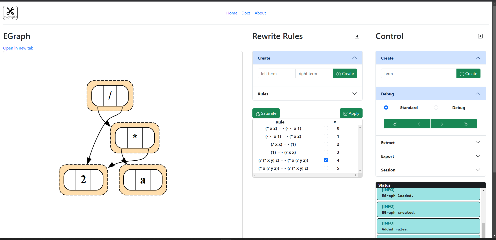

# Benutzung

Nach dem Starten der Anwendung öffnet sich ein Browser-Fenster und die Benutzeroberfläche erscheint.

## E-Graph

In diesem Segment wird der E-Graph gerendert. Der E-Graph kann mithilfe des Mausrades oder des Touchpads vergrößert und verkleinert werden.
Zudem kann er mit dem Cursor hin- und hergezogen werden.

Der Link _Open in new tab_ öffnet die gleiche Ansicht auf den E-Graph in einem neuen Tab. Das kann hilfreich sein, wenn der vorhandene Bildschirm zu klein ist oder der E-Graph getrennt
betrachtet werden soll.

Das **Hovern** mit dem Cursor über einzelne, beige eingefärbte E-Classes verrät die EClass-ID.

## Rewrite Rules

In diesem Segment kan der Benutzer rewrite rules erzeugen und auf den E-Graph anwenden. Mehr dazu erfahren Sie [hier](/docs/benutzung/rewriterules/).

## Control

In diesem Segment befinden sich die restlichen Steuerelemente. Darüber hinaus kann hierüber ein E-Graph erstellt werden. Mehr zur Funktionalität finden Sie [hier](/docs/benutzung/control/).
