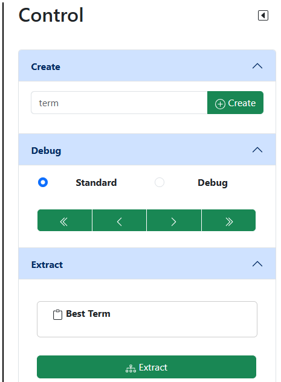
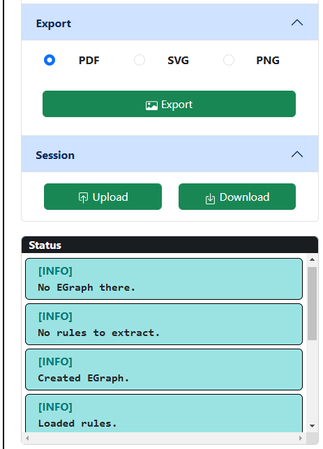

# Control

## Teil 1

Der kleine schwarze Pfeil rechts oben minimiert dieses Segment.

### Create

Geben Sie im Eingabefeld einen Term ein, der den Syntax-Regeln entspricht (siehe [rewrite rules](/docs/benutzung/rewriterules/)) und drücken Sie anschließend auf
den Button **Create**. Ein neuer E-Graph wird erstellt.

**Bemerkung**: Falls Sie vorher bereits einen E-Graph erzeugt haben, wird das Programm Sie fragen, ob Sie diesen und alle anderen Daten löschen möchten. 

### Debug

Dieses Feature ermöglicht es Ihnen, Veränderungen am E-Graph zu verfolgen. Dazu können sie auswählen, wie detailiert die Ausgabe sein soll. _Standard_ gibt Ihnen nur das Resultat einzelner
Aktionen (z.B. dem Anwenden einer rewrite rule), während _Debug_ mehr Details liefert. Um auch vergangene Änderungen nocheinmal ansehen zu können, enthält dieses Segment vier Buttons. Die beiden Äußeren (*\<* und *\>*) springen
zwischen zwei Aktionen vor oder zurück. Die beiden mittleren (*\<\<* und *\>\>*) sind nur im _Debug_-Modus aktiviert und ermöglichen Ihnen, auch kleinere Änderungen beobachten zu können.

### Extract

Durch das Drücken des Buttons **Extract** wird der optimale Term aus dem E-Graph extrahiert und im darüber liegenden Feld angezeigt.
Wenn Sie den Term in die lokale Zwischenablage kopieren möchten, drücken Sie auf den Button **Best Term**.
Wenn Sie den Prozess beobachten möchten, muss der Debug-Modus aktiviert sein. 

## Teil 2

### Export

Der E-Graph, der momentan angezeigt wird, kann in ein Dateiformat exportiert werden. Die entsprechende Datei wird im selben Verzeichnis, in der sich die Anwendung befindet, erstellt.

### Session

Eine Session beinhaltet folgendes:

- dem mathematischen Ausdruck, aus dem der E-Graph erzeugt wurde
- rewrite rules mit einem Vermerk, welche bereits angewendet wurden
- eventuell bereits extrahierter, optimaler Term

Wenn Sie ihren Lernstand beibehalten möchten, können Sie auf **Download** drücken. Eine JSON-Datei wird im Verzeichnis dieser Anwendung erstellt. Achten Sie auf die Statusmeldung unten rechts auf der Website.
Dort wird der Download zusammen mit dem Speicherort noch einmal bestätigt.

Wenn Sie die Anwendung jetzt herunterfahren und sie erneut starten, können Sie über den Button **Upload** die Datei auf den Server laden. Auch das wird erneut mit einer Statusmeldung bestätigt.

**Achtung**: Sollten Sie den Inhalt der Datei verändert oder das Format beschädigt haben, kann es eventuell passieren, dass die Datei nicht angenommen wird.

### Status

Im Statusfeld werden Meldungen des Servers angezeigt. Dabei gibt es folgende Typen von Meldungen: INFO, WARN und ERROR.
Für detailierte Meldungen, zum Beispiel beim Anwenden einer rewrite rule, muss der Debug-Modus aktiviert sein.
